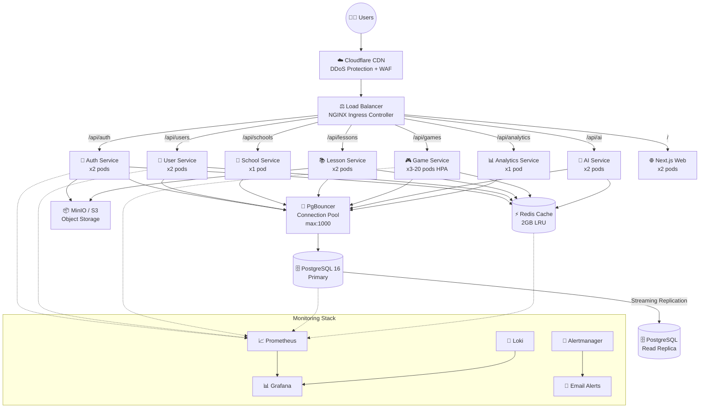

# Galactic Ionosphere — Global Architecture

## Mimari Diyagram



## Cache Stratejisi

| Cache Tipi | Key Pattern | TTL | Açıklama |
|---|---|---|---|
| Session | `session:{userId}` | 15 dk | JWT token cache |
| Lesson | `lesson:{id}:v{version}` | 1 saat | Ders içeriği |
| Game State | `game:{id}:state:{sessionId}` | 30 dk | Canlı oyun durumu |
| Game Catalog | `games:catalog:{page}` | 5 dk | Oyun listesi |
| AI Response | `ai:response:{hash}` | 24 saat | Tekrarlayan AI yanıtları |
| API Response | `api:{route}:{params}:{userId}` | 5 dk | Genel API cache |
| User Profile | `user:{id}:profile` | 30 dk | Kullanıcı profili |
| School | `school:{id}` | 1 saat | Okul bilgisi |

## Servis Portları

| Servis | Port | Protokol |
|---|---|---|
| NGINX | 80, 443 | HTTP/HTTPS |
| Auth Service | 3001 | HTTP |
| School Service | 3002 | HTTP |
| User Service | 3003 | HTTP |
| Lesson Service | 3005 | HTTP |
| Game Service | 3007 | HTTP + WebSocket |
| AI Service | 3008 | HTTP |
| Analytics Service | 3009 | HTTP |
| Web Frontend | 3000 | HTTP |
| PostgreSQL | 5432 | TCP |
| PgBouncer | 5433 | TCP |
| Redis | 6379 | TCP |
| MinIO API | 9000 | HTTP |
| MinIO Console | 9001 | HTTP |
| Prometheus | 9090 | HTTP |
| Grafana | 3030 | HTTP |
| Loki | 3100 | HTTP |
| Alertmanager | 9093 | HTTP |

## Auto Scaling Politikası

| Servis | Min | Max | CPU Threshold |
|---|---|---|---|
| auth-service | 2 | 8 | 70% |
| user-service | 2 | 10 | 70% |
| lesson-service | 2 | 12 | 70% |
| **game-service** | **3** | **20** | **65%** (agresif) |
| ai-service | 2 | 8 | 75% |
| web | 2 | 10 | 70% |

## Hızlı Başlangıç

### Development (Docker Compose)
```bash
# Tüm sistemi başlat
docker-compose -f infrastructure/docker/docker-compose.yml up -d

# Sadece altyapıyı başlat (DB, Redis, MinIO)
docker-compose -f infrastructure/docker/docker-compose.yml up -d postgres redis minio

# Monitoring'i başlat
docker-compose -f infrastructure/docker/docker-compose.yml up -d prometheus grafana loki
```

### Production (Kubernetes)
```bash
# Namespace ve config
kubectl apply -f infrastructure/k8s/namespace.yaml
kubectl apply -f infrastructure/k8s/configmap.yaml

# Secrets (önce doldur!)
cp infrastructure/k8s/secrets.template.yaml infrastructure/k8s/secrets.yaml
# secrets.yaml'ı düzenle...
kubectl apply -f infrastructure/k8s/secrets.yaml

# Databaser
kubectl apply -f infrastructure/k8s/deployments/db-deployments.yaml
kubectl apply -f infrastructure/k8s/services/services.yaml

# Uygulamalar
kubectl apply -f infrastructure/k8s/deployments/app-deployments.yaml

# Ingress & HPA
kubectl apply -f infrastructure/k8s/ingress/ingress.yaml
kubectl apply -f infrastructure/k8s/hpa/hpa.yaml
```

### Monitoring URLs (Dev)
| Servis | URL | Kullanıcı adı/Şifre |
|---|---|---|
| Grafana | http://localhost:3030 | admin / platform_grafana_pass |
| Prometheus | http://localhost:9090 | — |
| Alertmanager | http://localhost:9093 | — |
| MinIO Console | http://localhost:9001 | platform_admin / platform_minio_pass |
